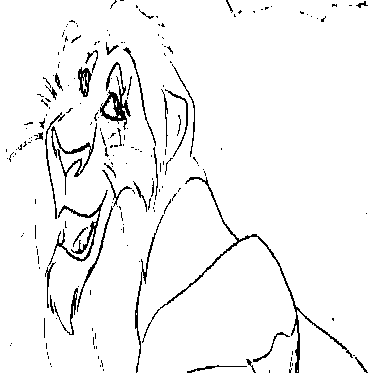
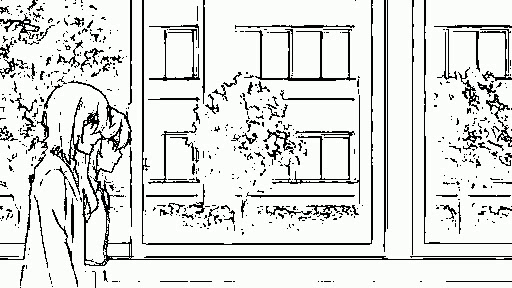
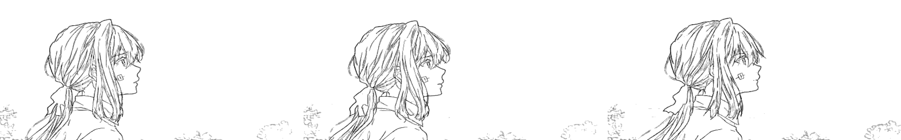

# Animation-GAN-InBetwener
This is an automatic In-Betweening tool for traditional 2D animation.

Given 2 drawings, this tool generates an intermediate one using a supervised autoencoder (U-Net like) and Generative Adversarial Networks (GAN). For an in-depth description of the model, experiments and results in its entirety, download the thesis document, [In-between frame generation for uncolored 2D animation](https://drive.google.com/file/d/1QYXvTovd8EeVhUQjnB7PIwIJXs7YR-JU/view?usp=sharing).

<table>
  <tr>
    <td align="center">
      
      <br />
      <font size="4"><b>Key frame 1</b></font>
    </td>
    <td align="center">
      
      <br />
      <font size="4"><b>In-between</b></font>
    </td>
        <td align="center">
      
      <br />
      <font size="4"><b>Key frame 2</b></font>
    </td>
  </tr>
</table>


**TL;DR**

Traditional 2D animation remains a largely manual process where each frame in a video is hand-drawn, as no robust algorithmic solutions exist to assist in this process. This project introduces a system that generates intermediate frames in an uncolored 2D animated video sequence using Generative Adversarial Networks (GAN), a relatively inexpensive deep learning approach widely used for tasks within the creative realm. We treat the task as a frame interpolation problem, and show that adding a GAN dynamic to a system significantly improves the perceptual fidelity of the generated images, as measured by perceptual metrics that aim to capture human judgment of image quality. Moreover, this thesis proposes a simple end-to-end training framework that avoids domain transferability issues that arise when leveraging components pre-trained on natural video. Lastly, we show that the two main challenges for frame interpolation in this domain, large motion and information sparsity, interact such that the magnitude of objects' motion across frames conditions the appearance of artifacts associated with information sparsity.


## Requirements
### Docker
The simplest way to re-create the virtual environment used in this project is by pulling its docker image and crating a container.
```
docker pull frannarp/gan-inbetween:latest
```
Then, access the `docker/run_docker.sh` file and set the `HOST_DIRECTORY` to the path in your local machine where the repository was cloned. Then run the following command:
```
bash docker/run_docker.sh
```
This will create a container with the pulled Docker image and mount it in your local repository.

### Manual installation (alternative to Docker)
- PyTorch = 2.0.1
- Torchvision = 0.15.2
- Numpy = 1.24.3
- OpenCV = 4.7.0.72
- SciPy = 1.10.1
- Matplotlib = 3.7.1
- SciKit-Image = 0.20.0
- Cupy = 12.1.0
- Torchmetrics = 0.11.4
- Kornia = 0.6.12
- Pillow = 9.4.0
- Tqdm = 4.65.0

You can install all these packages in your own environment by running the following command:
```
bash docker/install_packages.sh
```
This installation does not require Docker, despite the directory name.

## Generate in-between frames
<table>
  <tr>
    <td align="center">
      
      <br />
      <font size="4"><b>Pair of keyframes</b></font>
    </td>
    <td align="center">
      
      <br />
      <font size="4"><b>Generated triplet (with added in-between)</b></font>
    </td>
  </tr>
</table>

To generate an in-between frame given a pair of end-frames, download the generator model's [checkpoints](https://drive.google.com/file/d/1HNBLPgWxvDbKNrPAua-SUQVr7d-zQgRl/view?usp=sharing), and save them in the `checkpoints/` directory. Then, run the following command:
```
python scripts/generate.py
```
This action will generate an intermediate frame for a provided sample pair of end-frames and save it in the `to_generate/wo_gt/` directory with the tile `in-between.png` along with a gif of the resulting triplet (sequence of 3 frames - the 2 end-frames + the in-between frame). To test your own pair of end-frames, replace the frames in the `to_generate/wo_gt/` directory with your own. 

### Frame triplets (with ground truth in-betweens)
To test the generation of a known in-between frame, run the following command:
```
bash python scrips/generate.py 'gt'
```
This action will generate an intermediate frame for a provided triplet and save it in the `to_generate/w_gt/` directory with the title `in-between.png` along with a gif of the resulting triplet (with the generated in-between), as well as a gif with the original triplet (with the real in-between). In addition, a gif of the resulting triplet, overlapping the generated frame with the real frame is also provided, in order to help visualize generation errors.


## Generate a video
<table>
  <tr>
    <td align="center">
      
      <br />
      <font size="4"><b>Original video</b></font>
    </td>
    <td align="center">
      
      <br />
      <font size="4"><b>Video with generated In-betweens</b></font>
    </td>
  </tr>
</table>


To add generated frames to a video, run the following command:
```bash
python scripts/generate_from_vid.py
```
This action will first extract the line-art from an animated video (in-between frames are usually produced as uncolored drawings), then produce a video with the same frame-rate as the input video, but replacing duplicate frames in the input video with generated frames (traditional 2D animation commonly produces videos with at least 50% duplicated frames to save costs). 

<div align="center">
  <br>
  <b>Before line extraction</b>
  <br><br>
  <br>
  <b>After line extraction</b>
</div>


## Train system
To train the system, run the following command:
```
scripts/run_experiment.py --config experiment_configs/default.ini
```
This action will perform training from scratch with the parameters optimized by the authors of this repository as default. Feel free to modify the `experiment_configs/default.ini` file to modify the trainig parameters, as well as visualization and evaluation configurations. The `scripts/run_experiment.py` file contains commented explanations of what each parameter does. For example, the `pretrain` parameter allows you to start training with the model's fully trained weights, which is convenient for fine-tuning to your own dataset.


